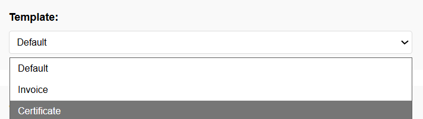
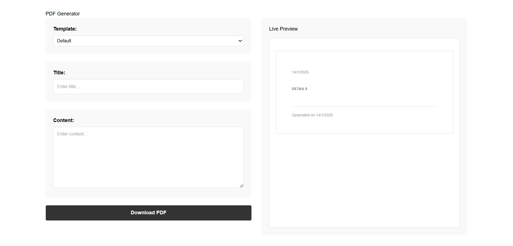
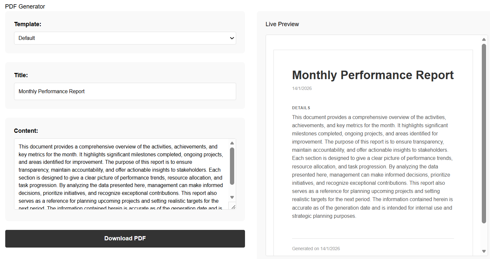
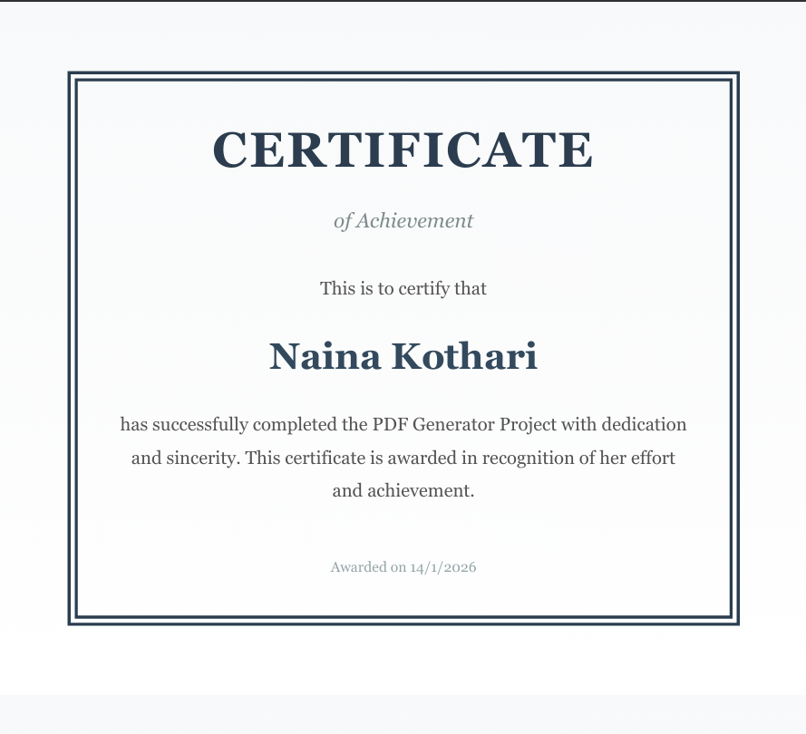
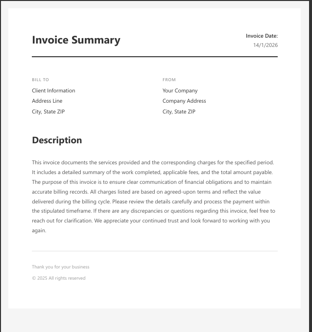

# PDF Generation Service: Dynamic Document Creation Platform

> A stateless Node.js microservice to generate professional PDFs from multiple templates.

A professional, stateless PDF generation microservice built with Node.js and React. Generate professional PDFs with multiple templates, real-time preview, and instant downloads.

[](https://github.com)

## TL;DR Quick Start

```bash
# Clone and install
git clone https://github.com/yourusername/pdf-generation-service.git
cd pdf-generation-service

# Backend
cd backend
npm install
npm start  # Runs on http://localhost:5002

# Frontend (in new terminal)
cd frontend
npm install
npm run dev  # Runs on http://localhost:5173
```

Open `http://localhost:5173`, select a template, enter content, and download your PDF.

## Table of Contents
- [Why PDF Generation Service](#why-pdf-generation-service)
- [Features](#features)
- [Architecture](#architecture)
- [Tech Stack](#tech-stack)
- [Installation](#installation)
- [API Reference](#api-reference)
- [Templates](#templates)
  - [Default Template](#default-template)
  - [Invoice Template](#invoice-template)
  - [Certificate Template](#certificate-template)
  - [Creating Custom Templates](#creating-custom-templates)
- [Configuration](#configuration)
- [Screenshots](#screenshots)
  - [Template Selection](#template-selection-screenshot)
  - [Live Preview](#live-preview-screenshot)
  - [Generated PDFs](#generated-pdf-samples)
- [Deployment](#deployment)
- [Security](#security)
- [Contributing](#contributing)
- [Troubleshooting](#troubleshooting)
- [Roadmap](#roadmap)
- [License](#license)

## Why PDF Generation Service

PDF Generation Service simplifies professional document creation through a clean, stateless microservice architecture. It eliminates the need for complex PDF libraries in client applications and provides a unified interface for generating documents across multiple templates and styles.

**Key Benefits:**
- Stateless design for easy horizontal scaling
- No session management overhead
- Simple REST API integration
- Template-driven flexibility
- Production-ready architecture

## Features

- **Multiple Templates**: Default, Invoice, and Certificate templates with professional styling
- **Real-time Preview**: See your document as you type
- **Stateless Architecture**: Each request is independent - perfect for scaling
- **RESTful API**: Simple POST endpoint for PDF generation
- **Template Customization**: Easy to add new templates with HTML/CSS
- **Cross-platform**: Works on Windows, macOS, and Linux
- **Instant Download**: One-click PDF generation and download
- **Extensible**: Plugin architecture for custom features

## Architecture

**Core Design Principles:**
- **Stateless Service**: No server-side sessions, each request is self-contained
- **Separation of Concerns**: Frontend preview separate from backend generation
- **Template-Driven**: HTML/CSS templates for easy customization
- **Microservice Ready**: Designed for containerization and orchestration

**How It Works:**
1. User selects template and enters content in React frontend
2. Frontend shows real-time preview
3. User clicks "Download PDF"
4. POST request sent to backend with data and template selection
5. Backend populates HTML template with user data
6. Puppeteer renders HTML to PDF
7. PDF returned as downloadable file
8. Server cleans up resources (stateless - no session storage)

## Tech Stack

**Backend:**
- Node.js & Express - Lightweight HTTP server
- Puppeteer - Headless Chrome for PDF rendering
- CORS - Cross-origin request handling

**Frontend:**
- React 18 - Interactive UI
- Vite - Fast development and builds
- CSS3 - Responsive styling

## Installation

**Prerequisites:**
- Node.js 16+
- npm 8+
- 2GB free disk space

**Setup Steps:**

Follow the [Quick Start](#tldr-quick-start) commands above, or see detailed steps:

**Verify Installation:**
- Navigate to `http://localhost:5173`
- Select a template
- Enter sample data
- Click "Download PDF"
- Verify PDF downloads and opens correctly

## API Reference

### POST /pdf/generate

Generate a PDF document from template and data.

**Endpoint:** `http://localhost:5002/pdf/generate`

**Request Body:**
```json
{
  "title": "Document Title",
  "content": "Document content text",
  "template": "default"
}
```

**Parameters:**
- `title` (string, required) - Document title
- `content` (string, required) - Main content body
- `template` (string, required) - One of: `default`, `invoice`, `certificate`

**Response:**
- Status: 200 OK
- Content-Type: `application/pdf`
- Body: Binary PDF data

**Example with cURL:**
```bash
curl -X POST http://localhost:5002/pdf/generate \
  -H "Content-Type: application/json" \
  -d '{
    "title": "Invoice #123",
    "content": "Thank you for your business",
    "template": "invoice"
  }' \
  --output invoice.pdf
```

**Example with JavaScript:**
```javascript
const response = await fetch('http://localhost:5002/pdf/generate', {
  method: 'POST',
  headers: { 'Content-Type': 'application/json' },
  body: JSON.stringify({
    title: 'My Document',
    content: 'Document content here',
    template: 'default'
  })
});

const blob = await response.blob();
const url = window.URL.createObjectURL(blob);
const a = document.createElement('a');
a.href = url;
a.download = 'document.pdf';
a.click();
```

**Error Responses:**
- `400` - Missing required fields
- `404` - Template not found
- `500` - PDF generation failed

## Templates

### Available Templates

#### Default Template
- Clean, minimalist layout
- Suitable for letters, reports, general documents
- Large title with readable content area

[See Default Template Screenshot](#default-template-screenshot)

#### Invoice Template
- Professional business invoice design
- Header for company details
- Line items with pricing
- Total calculations area

[See Invoice Template Screenshot](#invoice-template-screenshot)

#### Certificate Template
- Formal centered layout
- Large title area
- Decorative borders
- Signature lines

[See Certificate Template Screenshot](#certificate-template-screenshot)

#### Creating Custom Templates

1. Create HTML file in `backend/templates/`:
```html
<!DOCTYPE html>
<html>
<head>
  <meta charset="UTF-8">
  <style>
    body { font-family: Arial; margin: 40px; }
    h1 { color: #333; }
  </style>
</head>
<body>
  <h1>{{title}}</h1>
  <p>{{content}}</p>
</body>
</html>
```

2. Register template in backend route handler
3. Add to frontend dropdown

**Template Best Practices:**
- Use inline CSS (external stylesheets don't load in PDFs)
- Include proper DOCTYPE and charset
- Use web-safe fonts or embed as base64
- Test with various content lengths

## Configuration

**Backend Environment Variables:**

Create `.env` file in backend directory:
```
PORT=5002
NODE_ENV=development
CORS_ORIGIN=http://localhost:5173
```

**PDF Generation Options:**
```javascript
{
  format: 'A4',
  printBackground: true,
  margin: {
    top: '20mm',
    right: '20mm',
    bottom: '20mm',
    left: '20mm'
  }
}
```

**Frontend Configuration:**
- API endpoint: Update in frontend code if deploying to different URL
- Default: `http://localhost:5002/pdf/generate`

## Screenshots

#### Template Selection Screenshot


#### PDF Generator Interface


#### Live Preview Screenshot


#### Default Template Screenshot


#### Certificate Template Screenshot


#### Invoice Template Screenshot


#### Generated PDF Samples
Examples of final PDF outputs across different templates shown above.

## Deployment

**Development:**
- Local setup with hot reloading
- Debug logging enabled
- CORS for localhost

**Production Options:**

**Traditional Hosting:**
- Deploy to VPS (DigitalOcean, AWS EC2, Linode)
- Use PM2 for process management
- Nginx for reverse proxy

**Platform-as-a-Service:**
- Heroku, Railway, Render
- Zero-config deployment
- Automatic HTTPS

**Containerized:**
```dockerfile
# Example Dockerfile for backend
FROM node:18
WORKDIR /app
COPY package*.json ./
RUN npm install
COPY . .
EXPOSE 5002
CMD ["npm", "start"]
```

**Deployment Checklist:**
- Set environment variables
- Create production build
- Configure HTTPS/SSL
- Set CORS for production domain
- Enable error logging
- Set up health checks

## Security

**Essential Security Measures:**

**Input Validation:**
- Sanitize all user input to prevent XSS
- Validate template selection against whitelist
- Limit content length (prevent DoS)
- Escape special characters in templates

**API Security:**
- Implement rate limiting (e.g., 100 requests/hour)
- Add authentication for production (JWT, API keys)
- Use HTTPS in production
- Set appropriate CORS policies

**Data Privacy:**
- Don't log sensitive content
- Implement data retention policies
- Consider GDPR compliance
- Secure file storage if persisting PDFs

**Dependency Security:**
```bash
# Check for vulnerabilities
npm audit

# Update dependencies
npm update
```

## Contributing

**How to Contribute:**
1. Fork the repository
2. Create feature branch: `git checkout -b feature/your-feature`
3. Make changes with clear commits
4. Write or update tests
5. Update documentation
6. Submit pull request

**Code Standards:**
- Follow existing formatting
- Use meaningful names
- Add comments for complex logic
- Keep functions focused
- Use ES6+ features

## Troubleshooting

**Common Issues:**

**Q: PDF generation fails with "Protocol error"**
A: Puppeteer needs Chrome dependencies. On Linux:
```bash
sudo apt-get install -y libgbm-dev libasound2
```

**Q: Downloaded PDF is blank**
A: Ensure template uses inline CSS, not external stylesheets.

**Q: CORS errors in browser console**
A: Check backend CORS configuration includes your frontend origin.

**Q: Port already in use**
A: Change port in configuration or stop conflicting process:
```bash
# Find process on port 5002
lsof -i :5002
# Kill process
kill -9 <PID>
```

**Q: Custom fonts don't appear in PDF**
A: Embed fonts as base64 in template CSS or ensure font files are accessible to backend.

**Q: How do I add new fields to templates?**
A: Add placeholders like `{{field_name}}` to template HTML, then update backend and frontend to handle the new fields.

## Roadmap

**Short-term:**
- Template builder UI
- User authentication
- Charts and graphs support
- Batch PDF generation from CSV
- Enhanced error messages

**Long-term:**
- Multi-page document support
- PDF editing (merge, split, rotate)
- CMS integrations (WordPress, Drupal)
- Mobile app
- AI-powered template suggestions

## License

This project is released under the [MIT License](LICENSE). Free to use, modify, and distribute in private and commercial projects.

## Acknowledgments

- **Puppeteer Team** - Headless Chrome automation
- **React Community** - UI library and ecosystem
- **Vite Team** - Fast build tooling
- **Express.js** - Web framework
- **Open Source Community** - Continuous inspiration

**Author:** Naina Kothari

---

## Get Involved

If you found this project helpful, please consider:
- Starring the repository on GitHub
- Reporting bugs you encounter
- Suggesting features you'd like to see
- Contributing code improvements
- Improving documentation for other users

[](https://github.com)

---

**Thank you for using PDF Generation Service!** This project represents a commitment to making document generation accessible, flexible, and developer-friendly. Whether you're building an invoicing system, certificate generator, or custom document workflow, we hope this service makes your life easier.
